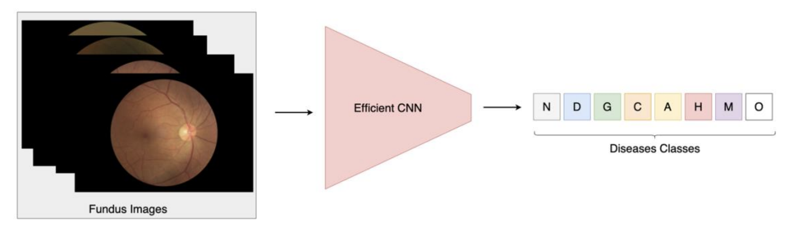

# Performance Analysis of Efficient Deep Learning Models for MultiLabel Classification of Fundus Image

[Paper](https://dergipark.org.tr/tr/download/article-file/3202713) | Published in  ARTIFICIAL INTELLIGENCE THEORY AND APPLICATIONS 2023 (AITA 2023)

**Abstract**

Convolutional Neural Networks (CNNs) have demonstrated significant advancements in the
domain of fundus images owing to their exceptional capability to learn meaningful features. By
appropriately processing and analyzing fundus images, computer-aided diagnosis systems can
furnish healthcare practitioners with valuable reference information for clinical diagnosis or
screening purposes. Nevertheless, prior investigations have predominantly concentrated on
detecting individual fundus diseases, while the simultaneous diagnosis of multiple fundus
diseases continues to pose substantial challenges. Furthermore, the majority of previous studies
have prioritized diagnostic accuracy as their main focus. Efficient Deep Learning constitutes a
crucial concept that enables the utilization of deep learning models on edge devices, thereby
reducing the computational carbon footprint. Facilitating the cost-effective diagnosis of eye
diseases from fundus images on edge devices holds significance for researchers aiming to deploy
these vital healthcare models into practical use. This study focuses on assessing the performance
of well-known efficient deep learning models in addressing the multi-label classification problem
of fundus images. The models underwent training and testing using the dataset provided by
international competition on ocular disease intelligent recognition in 2019. The experimental
findings demonstrate that the efficientnetb3 model outperforms the other models, exhibiting the
highest level of performance. And also, when applying standard data augmentation techniques
to the current dataset, we observe decreasing in f1-score and accuracy.



## Create  environment

```bash
conda create -n classifer python=3.9 -y
pip install -r requirements.txt
```

## Dataset

The dataset can be downloaded from [here](https://www.kaggle.com/datasets/andrewmvd/ocular-disease-recognition-odir5k).

## Training

```bash
python trainer.py
```

## Inference

```bash
python inference.py
```

## Evaluation

### FPS

```bash
python fps.py
```

### F1

```bash
python f1_score.py
```